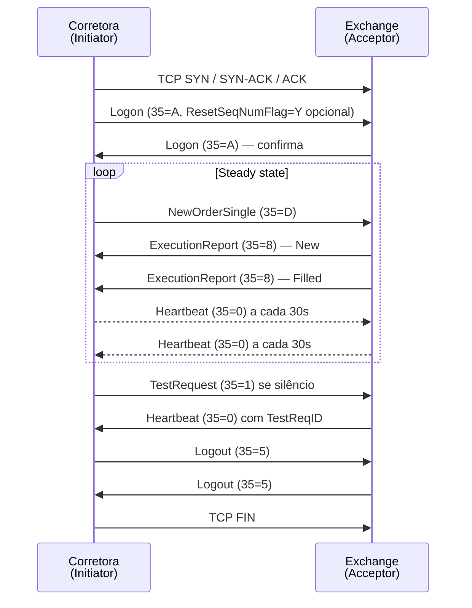
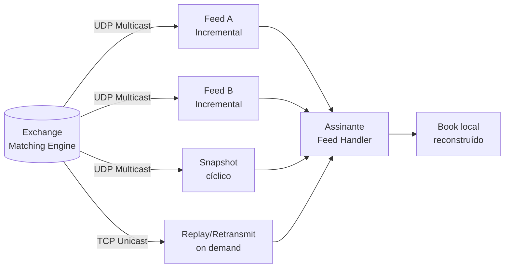

# Protocolo FIX — Financial Information eXchange

O **FIX (Financial Information eXchange)** é o protocolo de mensageria padrão de fato da indústria financeira global para comunicação de ordens, execuções, dados de mercado e pós-negociação entre **corretoras**, **bolsas**, **gestoras**, **bancos**, **provedores de liquidez** e plataformas de roteamento. Foi criado em **1992** por Salomon Brothers e Fidelity Investments e hoje é mantido pela [FIX Trading Community](https://www.fixtrading.org/), uma organização sem fins lucrativos com mais de 300 instituições membros.

No mercado brasileiro, o FIX é a base da conectividade com a **B3** (PUMA Trading System) tanto para o segmento **Bovespa** (renda variável: ações, ETFs, BDRs, opções) quanto para o segmento **BM&F** (derivativos, futuros, dólar, índice). Internacionalmente, é adotado por NYSE, Nasdaq, CME, Eurex, LSE, JPX, HKEX e praticamente todas as principais exchanges.

## Linha do tempo das versões

| Ano | Versão | Marco |
|---|---|---|
| 1992 | FIX 2.7 | Primeira versão pública (apenas equities, EUA) |
| 1995 | FIX 3.0 | Suporte a múltiplos mercados e tipos de ordem |
| 1998 | FIX 4.0 | Padronização do session layer e do checksum |
| 2000 | FIX 4.2 | Mais amplamente adotado da família 4.x |
| 2001 | FIX 4.3 | Suporte a derivativos listados |
| 2003 | FIX 4.4 | Pós-negociação, allocations, confirmations |
| 2006 | FIX 5.0 | Separação entre **session layer** (FIXT 1.1) e **application layer** |
| 2008 | FIX 5.0 SP1 | Service Pack 1 — correções e novas mensagens |
| 2011 | **FIX 5.0 SP2** | **Versão atual de referência** — última grande release da família 5.x; estendida continuamente via *Extension Packs* (EPs) |
| 2013+ | **FIX Latest** | Modelo de release contínua via EPs sobre FIX 5.0 SP2 / FIXT 1.1 |

> A FIX Trading Community deixou de publicar grandes releases versionadas. Desde 2013 o padrão é **FIX Latest**, que corresponde a FIX 5.0 SP2 + FIXT 1.1 + todos os Extension Packs aprovados (já passou de **EP 280+**). Quando se fala hoje em "última versão do FIX", na prática se está falando de **FIX 5.0 SP2 com FIXT 1.1**, atualizado pelos EPs.

## A última versão — FIX 5.0 SP2 / FIXT 1.1

A grande mudança da família **5.0** foi a separação em duas camadas independentes:

| Camada | Padrão | Responsabilidade |
|---|---|---|
| **Session Layer** | **FIXT 1.1** (FIX Transport) | Logon/Logoff, sequenciamento, heartbeat, retransmissão (`ResendRequest`), checksum |
| **Application Layer** | **FIX 5.0 SP2** | Ordens, execuções, market data, allocations, post-trade |

Essa separação permite que **a mesma sessão FIXT** transporte mensagens de versões diferentes da camada de aplicação, e que novas mensagens sejam adicionadas via Extension Packs sem quebrar implementações existentes.

### Principais novidades introduzidas na linha 5.0 SP2

- **Pre-Trade**: cotações multi-leg, RFQ (Request For Quote) estendido, indicações de interesse (`IOI`).
- **Trade**: novos tipos de ordem (Pegged, Discretion, Trailing Stop, Cross), suporte robusto a *multi-leg* (estratégias de opções e futuros) e a *algorithmic orders* via tag `AlgoStrategy`.
- **Post-Trade**: `AllocationInstruction`, `Confirmation`, `SettlementInstruction`, `TradeCaptureReport` para fluxos de give-up, allocation e regulatory reporting.
- **Market Data**: `MarketDataIncrementalRefresh` por *order book level*, suporte a *Market By Price* (MBP) e *Market By Order* (MBO).
- **Reference Data**: `SecurityListRequest`, `DerivativeSecurityList` para descoberta dinâmica de instrumentos.
- **Regulatory Reporting**: campos para MiFID II, Dodd-Frank, EMIR, SFTR.

### Codificações disponíveis

A mesma semântica FIX pode trafegar em diferentes representações *on-the-wire*:

| Codificação | Característica | Uso típico |
|---|---|---|
| **Tag=Value (Classic FIX)** | Texto ASCII com pares `tag=valor` separados por `SOH (0x01)` | Ordens / sessões TCP — formato dominante |
| **FIXML** | XML | Pós-negociação e regulatory reporting |
| **FAST (FIX Adapted for STreaming)** | Binário com compressão por templates | Market data multicast UDP de alta vazão |
| **SBE (Simple Binary Encoding)** | Binário fixed-width, *zero-copy* | Market data e ordens de baixíssima latência (CME, ICE) |
| **FIX/JSON** | JSON | Integrações REST/Web |
| **GPB (Google Protobuf)** | Binário esquema-baseado | Implementações modernas |

> **FAST** e **SBE** foram criadas justamente para superar a verbosidade do *tag=value* em cenários de market data UDP, onde milhões de mensagens por segundo precisam caber em pacotes de MTU típica.

## Anatomia de uma mensagem FIX (tag=value)

```
8=FIXT.1.1|9=178|35=D|34=215|49=BROKER01|56=B3PUMA|52=20260513-14:22:01.123
|11=ORD-987654|55=PETR4|54=1|38=100|40=2|44=38.75|59=0|60=20260513-14:22:01
|10=187|
```

Onde `|` representa o caractere separador `SOH (0x01)`. Cada `tag=valor` carrega um campo:

| Tag | Nome | Valor | Significado |
|---|---|---|---|
| `8` | `BeginString` | `FIXT.1.1` | Versão do session layer |
| `9` | `BodyLength` | `178` | Tamanho do corpo (após tag 9 até antes do tag 10) |
| `35` | `MsgType` | `D` | `NewOrderSingle` |
| `34` | `MsgSeqNum` | `215` | Número de sequência da sessão |
| `49` | `SenderCompID` | `BROKER01` | Originador |
| `56` | `TargetCompID` | `B3PUMA` | Destino |
| `11` | `ClOrdID` | `ORD-987654` | ID único do cliente |
| `55` | `Symbol` | `PETR4` | Instrumento |
| `54` | `Side` | `1` | 1 = Buy, 2 = Sell |
| `38` | `OrderQty` | `100` | Quantidade |
| `40` | `OrdType` | `2` | 1 = Market, 2 = Limit, 3 = Stop, 4 = StopLimit |
| `44` | `Price` | `38.75` | Preço limite |
| `59` | `TimeInForce` | `0` | 0 = Day, 1 = GTC, 3 = IOC, 4 = FOK |
| `10` | `CheckSum` | `187` | Soma módulo 256 de todos os bytes anteriores |

## FIX sobre TCP

A esmagadora maioria das sessões FIX trafega sobre **TCP**, que oferece exatamente as garantias necessárias para o fluxo de ordens:

- **Entrega ordenada e confiável** — combinada ao sequenciamento próprio do FIX (`MsgSeqNum`), evita perda silenciosa.
- **Conexão ponto-a-ponto** com autenticação por `SenderCompID` / `TargetCompID` + senha + (opcional) certificado/TLS.
- **Reenvio automático** em caso de gap (`ResendRequest` / `SequenceReset`).
- **Heartbeat** periódico (geralmente a cada 30 s) para detectar *hung sessions*.

### Ciclo de uma sessão FIXT 1.1 sobre TCP



### Recuperação de gap

Se a corretora recebe `MsgSeqNum=42` quando esperava `41`, dispara `ResendRequest (35=2)` pedindo a faixa `[41,41]`. A exchange retransmite `41` com `PossDupFlag=Y (43=Y)`. Sequência preservada, sem perda.

### Boas práticas operacionais para TCP

| Prática | Por quê |
|---|---|
| `TCP_NODELAY` (desativar Nagle) | Evita coalescência de pequenas mensagens, reduzindo latência |
| Sockets dedicados por sessão | Isolamento; evita *head-of-line blocking* |
| Keep-alive de SO + Heartbeat FIX | Dupla detecção de queda |
| TLS 1.2/1.3 obrigatório em links públicos | B3, NYSE e Eurex exigem TLS para sessões via internet |
| Persistência das sequências em disco | Permite *resume* após restart sem perda |
| Pinos de CPU + interrupt affinity | Latência sub-milissegundo em HFT |

## FIX sobre UDP — *market data* multicast

Para **market data**, o paradigma muda completamente: a exchange precisa entregar **uma mesma mensagem para milhares de assinantes simultaneamente**, com a menor latência possível e tolerando alguma perda. TCP não escala nesse cenário (uma sessão por assinante, retransmissões individuais). A solução é **multicast UDP** com codificações binárias compactas.

### Por que UDP?

| Propriedade | TCP | UDP Multicast |
|---|---|---|
| Modelo | Conexão 1:1 | Sem conexão, 1:N |
| Confiabilidade | Garantida pelo SO | Aplicação trata perdas |
| Ordem | Garantida | Não garantida |
| Latência | Maior (handshake, ACK, retransmissão) | Mínima |
| Escala para milhares de assinantes | Cara | Trivial — switch replica o pacote |

### Padrão de redundância: feeds A/B

Como UDP perde pacotes, exchanges publicam o mesmo conteúdo em **dois grupos multicast independentes** ("Feed A" e "Feed B"), em rotas físicas distintas. O assinante consome ambos e descarta duplicatas pela `MsgSeqNum`. A probabilidade de perder o mesmo pacote nos dois feeds é muito baixa.

### Recuperação de perdas em UDP

Quando, mesmo após o A/B, há um *gap*, há dois mecanismos:

1. **Snapshot Channel** (multicast UDP separado): a exchange retransmite continuamente o estado completo do book em ciclo. O assinante "espera" passar o snapshot mais recente e reaplica os incrementais a partir dali.
2. **Replay/Retransmission Service** (TCP unicast): o assinante abre uma sessão TCP/FIX dedicada e pede a faixa de sequência perdida. Tem custo e geralmente *rate limit*.



## FIX no mercado brasileiro

A **B3** é a única bolsa do Brasil e adota FIX em todas as suas plataformas críticas.

### Plataforma PUMA

| Aspecto | Detalhe |
|---|---|
| Versão de aplicação | **FIX 4.4 estendido** (com customizações B3) e **FIX 5.0 SP2** em novos serviços |
| Session layer | FIX 4.4 nativo nos gateways legados; **FIXT 1.1** nos novos |
| Transporte | TCP (TLS opcional/obrigatório por modalidade) |
| Segmentos | **Bovespa** (renda variável) e **BM&F** (derivativos) — sessões FIX separadas |
| Modalidades de acesso | DMA 1 (próprio), DMA 2 (via plataforma), DMA 3 (co-location), DMA 4 (intermediado) |
| Heartbeat | 30 s (padrão); negociável no Logon |
| Homologação | Ambiente UAT da B3 obrigatório antes de produção (2 a 6 semanas) |

### Feeds de market data da B3

| Feed | Protocolo | Conteúdo |
|---|---|---|
| **UMDF** (Unified Market Data Feed) | **Multicast UDP** + **FAST** | Top of book, trades, índices, *Level 2* agregado |
| **MBO** (Market By Order) | **Multicast UDP** + **SBE** (binário) | Cada ordem individual no book — *Level 3* |
| **PUMA Market Data via FIX** | TCP/FIX 5.0 SP2 (tag=value) | Versão FIX para integradores que não consomem multicast |
| **Snapshot** | UDP Multicast separado | Estado completo cíclico para resync |

> O **MBO** da B3 é a base para HFT e *latency arbitrage* na bolsa brasileira: entrega cada `New`, `Modify`, `Cancel` e `Trade` no nível de ordem individual.

### Pós-negociação e registro

Para CETIP/B3 Balcão (renda fixa, swaps, termos OTC) o FIX é menos comum — predominam **APIs REST proprietárias** e arquivos batch — mas existem fluxos FIX de *trade reporting* e *allocation* (`AllocationInstruction`, `TradeCaptureReport`) entre corretoras e administradores.

## FIX no mercado internacional

| Exchange / Mercado | Uso de FIX | Particularidades |
|---|---|---|
| **NYSE / NYSE Arca** | FIX 4.2 / 4.4 / 5.0 SP2 para ordens; **Pillar Binary** (proprietário) também aceito | Market data via **XDP** (binário UDP) |
| **Nasdaq** | FIX 4.2 / 5.0 SP2 (ordens — **OUCH** binário é alternativa de ultra-baixa latência) | **ITCH** (binário UDP multicast) para market data |
| **CME Group** (Chicago Mercantile) | FIX 4.2 / 5.0 SP2 + **iLink 3** (SBE binário sobre TCP) | **MDP 3.0** — SBE multicast UDP — para todo o market data de futuros |
| **ICE (Intercontinental Exchange)** | FIX 4.2 / 5.0 SP2 | Market data binário próprio |
| **LSE (Londres)** | FIX 5.0 SP2 (Native + FIX gateways) | **MITCH** binário UDP para market data |
| **Eurex / Deutsche Börse** | **Eurex T7** — FIX 5.0 SP2 + **EOBI** (Enhanced Order Book Interface) SBE multicast | Co-location em Frankfurt |
| **JPX (Japão)** | **arrowhead** — FIX 5.0 SP2 | Market data via FLEX Standard |
| **HKEX (Hong Kong)** | **OCG** — FIX 5.0 SP2 | Market data binário |
| **BME (Espanha)** | FIX 5.0 SP2 | SMART platform |
| **Buy-side global** | FIX usado para *order routing* entre asset managers, OMS/EMS (Bloomberg AIM, Charles River, Aladdin), *prime brokers* e *dark pools* | Conectividade ponta-a-ponta |

### Outros usos do FIX além de equities

- **Foreign Exchange (FX)**: ECNs como EBS, Reuters Matching, Currenex e *FX Connect* falam FIX para spot, forwards e NDFs.
- **Fixed Income / Renda fixa OTC**: MarketAxess, Tradeweb e Bloomberg ALLQ usam FIX para *Request For Quote* (RFQ) em bonds e CDS.
- **Derivativos OTC**: confirmations e allocations via FIX para swaps de juros e CDS.
- **Crypto**: exchanges institucionais como **Coinbase Prime**, **Kraken**, **Gemini** e **Binance** oferecem gateways FIX 4.4/5.0 para clientes profissionais.
- **Algorithmic & Smart Order Routing**: o tag `AlgoStrategy (847)` e o grupo `StrategyParameters` carregam parâmetros de algoritmos VWAP, TWAP, POV, IS etc.

## Comparativo TCP × UDP em FIX — quando usar cada um

| Caso de uso | Transporte | Codificação típica | Justificativa |
|---|---|---|---|
| Envio de ordens (order entry) | **TCP** | Tag=Value ou SBE | Não pode perder mensagem; ordem importa |
| Execution reports / drop copy | **TCP** | Tag=Value | Garantia de entrega para back office |
| Market data agregado / Level 1-2 | **UDP Multicast** | FAST | Alta vazão, broadcast |
| Market By Order (Level 3) | **UDP Multicast** | SBE | Latência mínima, milhões de msg/s |
| Snapshot de recovery | **UDP Multicast** | FAST/SBE | Cíclico, broadcast |
| Replay sob demanda | **TCP** | Tag=Value ou binário | Confiabilidade para preencher gaps |
| Pós-negociação / allocations | **TCP** | FIXML ou Tag=Value | Confiabilidade; volume baixo |
| RFQ em FX e Fixed Income | **TCP** | Tag=Value | Sessão persistente |

## Segurança e observabilidade

- **Autenticação**: `SenderCompID` + `TargetCompID` + senha no Logon; muitos *venues* exigem **TLS** com certificado mútuo.
- **Integridade**: cada mensagem termina com `CheckSum (10)` — soma módulo 256 dos bytes anteriores.
- **Não-repúdio**: armazenamento dos logs FIX brutos por **5 anos** (CVM Resolução 080) ou mais conforme jurisdição (MiFID II exige 7 anos).
- **Drop copy**: cópia em tempo real de todas as `ExecutionReport` para um sistema de risco/back office independente.
- **Monitoramento**: latência por hop (corretora → gateway → exchange), idade do último heartbeat, gaps de sequência, taxa de rejeição (`35=3 — Reject`, `35=j — BusinessMessageReject`).

## Bibliotecas e *engines* FIX populares

| Biblioteca | Linguagem | Licença | Notas |
|---|---|---|---|
| **QuickFIX** | C++ / Java / Python / .NET / Ruby / Go | BSD-style | A mais usada em open-source |
| **QuickFIX/J** | Java | Apache 2.0 | Fork Java mais ativo |
| **OnixS FIX Engine** | C++ / Java / .NET | Comercial | Alta performance, certificada para CME, B3 |
| **B2BITS / EPAM FIX Antenna** | C++ / Java / .NET | Comercial | Forte presença no Brasil |
| **Fix8** | C++ | GPL/Comercial | Foco em ultra-baixa latência |
| **Aeron + SBE** | Java / C++ | Apache 2.0 | Stack moderno para HFT (não é FIX puro, mas usa SBE) |

## Referências

- [FIX Trading Community — Specification](https://www.fixtrading.org/standards/)
- [FIX 5.0 SP2 Online Spec](https://www.fixtrading.org/online-specification/)
- [B3 — Manual de Conectividade do PUMA](https://www.b3.com.br/pt_br/solucoes/plataformas/conectividade/)
- [B3 — UMDF e MBO Specifications](https://www.b3.com.br/pt_br/market-data-e-indices/)
- [CME Group — MDP 3.0 / iLink 3](https://www.cmegroup.com/confluence/display/EPICSANDBOX/Market+Data)

> *Em construção: este conteúdo é atualizado conforme a B3 publica novos Extension Packs e atualizações do PUMA.*
