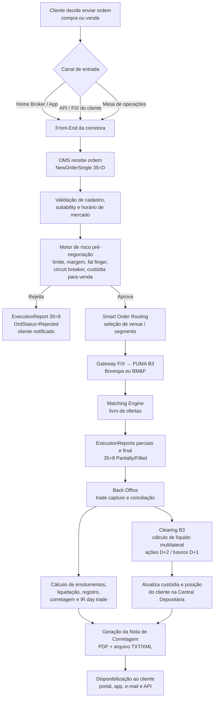
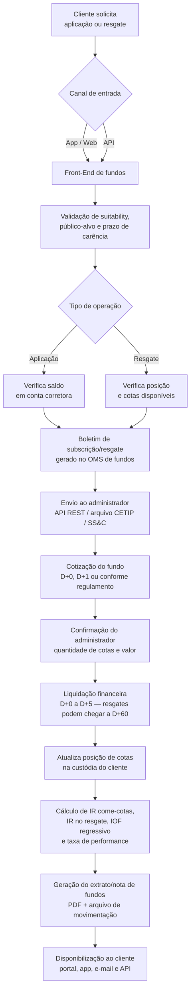
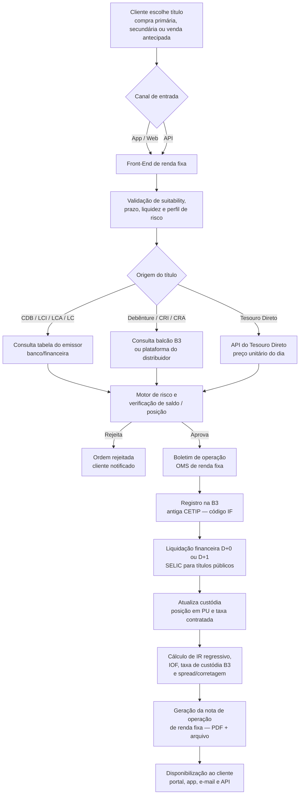

# Ordens e OMS

O **Order Management System (OMS)** é o núcleo operacional de uma corretora: recebe ordens dos clientes, aplica controles de risco, roteia para os destinos corretos e acompanha o ciclo de vida até a liquidação.

## Tipos de ordem

| Tipo | Descrição | Aplicável a |
|---|---|---|
| **Mercado** (Market) | Executa ao melhor preço disponível imediatamente | Ações, futuros |
| **Limitada** (Limit) | Executa somente no preço especificado ou melhor | Todos os ativos listados |
| **Stop Loss** | Ativada quando o preço atinge determinado gatilho | Ações, futuros |
| **Stop Gain** | Executa quando o preço sobe acima do gatilho | Ações, futuros |
| **Stop Duplo** | Combina stop loss e stop gain | Ações, futuros |
| **Iceberg** | Revela apenas parte da quantidade ao mercado | Ações (alta liquidez) |
| **MOC / LOC** | Market / Limit on Close — executa no leilão de fechamento | Ações |
| **A Mercado com Proteção** | Ordem de mercado com limite implícito de proteção | Ações B3 |

## Ciclo de vida de uma ordem

```
CRIADA (cliente envia)
   ↓ validação de cadastro, suitability, horário de mercado
VALIDADA
   ↓ motor de risco pré-negociação (limite de crédito, margem)
ACEITA
   ↓ roteamento para gateway (FIX / PUMA)
ENVIADA AO MERCADO
   ↓ livro de ofertas da exchange
PARCIALMENTE EXECUTADA  →  pode gerar novas ordens residuais
   ↓
TOTALMENTE EXECUTADA
   ↓ confirmações (trade reports) recebidas
CONFIRMADA
   ↓ back office: liquidação (D+0, D+1 ou D+2)
LIQUIDADA
```

**Estados de rejeição**: `REJEITADA_RISCO`, `REJEITADA_EXCHANGE`, `CANCELADA_CLIENTE`, `EXPIRADA`

## Protocolo FIX (Financial Information eXchange)

O protocolo **FIX 4.4** é o padrão internacional para comunicação de ordens entre corretoras e exchanges. A B3 utiliza uma variante via **PUMA** (Plataforma Unificada de Multi-Ativos).

### Mensagens FIX essenciais

| Tag FIX | Mensagem | Descrição |
|---|---|---|
| `D` | `NewOrderSingle` | Envio de uma nova ordem |
| `F` | `OrderCancelRequest` | Cancelamento de ordem |
| `G` | `OrderCancelReplaceRequest` | Alteração (preço/quantidade) |
| `8` | `ExecutionReport` | Retorno de execução / status |
| `9` | `OrderCancelReject` | Rejeição de cancelamento |
| `V` | `MarketDataRequest` | Solicitação de cotações |
| `W` | `MarketDataSnapshotFullRefresh` | Snapshot do book de ofertas |
| `X` | `MarketDataIncrementalRefresh` | Atualização incremental do book |

### Campos obrigatórios em `NewOrderSingle`

| Campo (Tag) | Descrição | Exemplo |
|---|---|---|
| `ClOrdID (11)` | ID único da ordem no lado da corretora | `ORD-20240101-0001` |
| `Symbol (55)` | Ticker do ativo | `PETR4` |
| `Side (54)` | `1` = Compra, `2` = Venda | `1` |
| `OrderQty (38)` | Quantidade | `100` |
| `OrdType (40)` | `1`=Mercado, `2`=Limitada, `3`=Stop | `2` |
| `Price (44)` | Preço limite (para OrdType=2) | `32.50` |
| `TimeInForce (59)` | `0`=Day, `1`=GTC, `3`=IOC, `4`=FOK | `0` |
| `Account (1)` | Conta do cliente | `C001234` |
| `TransactTime (60)` | Timestamp UTC da ordem | `20240101-10:30:00.123` |

## Controles de risco pré-negociação

Antes de enviar qualquer ordem ao mercado, o OMS deve aplicar:

### Controles obrigatórios (B3 / CVM)

- **Limite de posição bruta**: máximo de contratos/ações em aberto por cliente
- **Limite de perda diária**: valor máximo de prejuízo permitido no dia
- **Limite de ordem única**: valor máximo por ordem individual (evita "fat finger")
- **Verificação de margem**: saldo de garantia suficiente para derivativos
- **Restrições de ativo**: verificação de ativos suspensos ou em leilão
- **Verificação de saldo**: para operações de venda a descoberto, verificar custódia

### Regras específicas da B3

- Ordens acima de determinado volume acionam verificação de **Large Trader**
- Operações de **day trade** requerem controle separado de P&L intraday
- **Circuit breakers**: suspensão automática quando ativo oscila mais de 10%/15%

## Roteamento inteligente (Smart Order Routing — SOR)

Para ativos negociados em múltiplos venues (ex.: BDRs, ETFs), o SOR busca a melhor execução:

1. Consulta o book de ofertas de cada venue disponível
2. Calcula o preço médio esperado de execução (incluindo custos de transação)
3. Divide a ordem entre venues quando há liquidez fragmentada
4. Consolida as execuções parciais em uma única confirmação para o cliente

## Notas de corretagem

Após cada execução, a corretora deve emitir uma **Nota de Corretagem** contendo:

- Data e horário de execução
- Ativo, quantidade e preço
- Valor bruto da operação
- Emolumentos B3, taxa de liquidação, taxa de registro
- Corretagem cobrada
- Valor líquido (D+2 para ações, D+1 para futuros)
- Impostos retidos na fonte (IR sobre day trade)

## Fluxogramas de ordens (compra e venda)

Os diagramas abaixo cobrem o ciclo completo de uma ordem — desde o momento em que o cliente decide enviar a ordem até a geração e disponibilização do **arquivo da nota de corretagem / extrato** ao cliente — para cada classe de ativo intermediada pela corretora.

### Renda variável — ações e futuros (B3)

Aplica-se a ações, ETFs, BDRs, opções e derivativos listados (futuros de índice, dólar, juros, commodities). A execução ocorre no **PUMA** via FIX 4.4 e a liquidação é feita pela B3 (D+2 para ações, D+1 para futuros).



### Fundos de investimento (aplicação e resgate)

Para fundos, não há livro de ofertas: a corretora atua como **distribuidora**, encaminhando o boletim ao **administrador** do fundo. A cotização e a liquidação seguem o regulamento de cada fundo (D+0 a D+60).



### Renda fixa (CDB, LCI, LCA, debêntures, Tesouro Direto)

Em renda fixa privada o registro é feito na **B3 (antiga CETIP)**; no Tesouro Direto, a custódia é da própria B3 e a contraparte é o **Tesouro Nacional**. Não há matching contínuo: a corretora opera contra a **tabela de ofertas** do emissor ou da plataforma de balcão.


