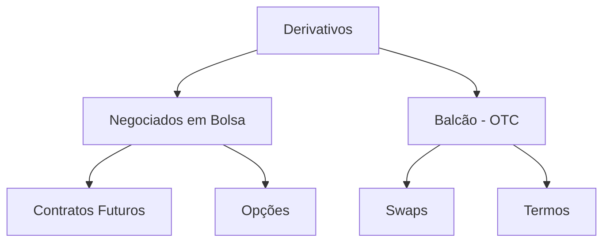

# Derivativos

Derivativos são instrumentos financeiros cujo valor **deriva** de um ativo subjacente — uma ação, taxa de juros, moeda, commodity ou índice. São utilizados para **hedge** (proteção), **especulação** ou **arbitragem**.

## Principais contratos na B3

| Tipo | Descrição | Exemplos |
|------|-----------|---------|
| Contrato futuro | Compra/venda padronizada com liquidação futura | DI1, DOL, WIN, WDO |
| Opção | Direito (não obrigação) de comprar/vender | Opções de ações, dólar |
| Swap | Troca de fluxos financeiros | CDI × câmbio, CDI × IPCA |
| Termo | Compra/venda com prazo e preço fixos (sem ajuste diário) | Termo de ações |

## Função econômica

- **Hedge**: protetor da variação de preços para exportadores, importadores, empresas
- **Especulação**: alavancagem para obter ganhos com variações de preço
- **Arbitragem**: exploração de diferenças de preços entre mercados

## Margem e alavancagem

A maioria dos derivativos exige depósito de **margem de garantia** (colateral), não o valor total do contrato. Isso cria **alavancagem**: exposição financeira superior ao capital depositado.

> Exemplo: depósito de R$ 10.000 para controlar um contrato DOL de R$ 100.000 = alavancagem de 10×.

## Ajuste diário

Nos contratos futuros, o resultado financeiro é calculado e liquidado **diariamente** pela B3 (câmara de compensação). Posições perdedoras pagam para posições ganhadoras ao final de cada pregão.

## Participantes

| Papel | Objetivo |
|-------|---------|
| Hedger | Reduzir risco de uma posição pré-existente |
| Especulador | Lucrar com variações de preço |
| Arbitrador | Explorar ineficiências de precificação |
| Market maker | Fornecer liquidez ao mercado |

## Classificação dos derivativos

## Regulamentação

Derivativos negociados em bolsa são regulamentados pela **CVM** e pela **B3** (autorregulação). Derivativos de balcão (OTC) são registrados na B3 ou CETIP (agora parte da B3) e supervisionados pelo **BCB** quando envolvem instituições financeiras.
