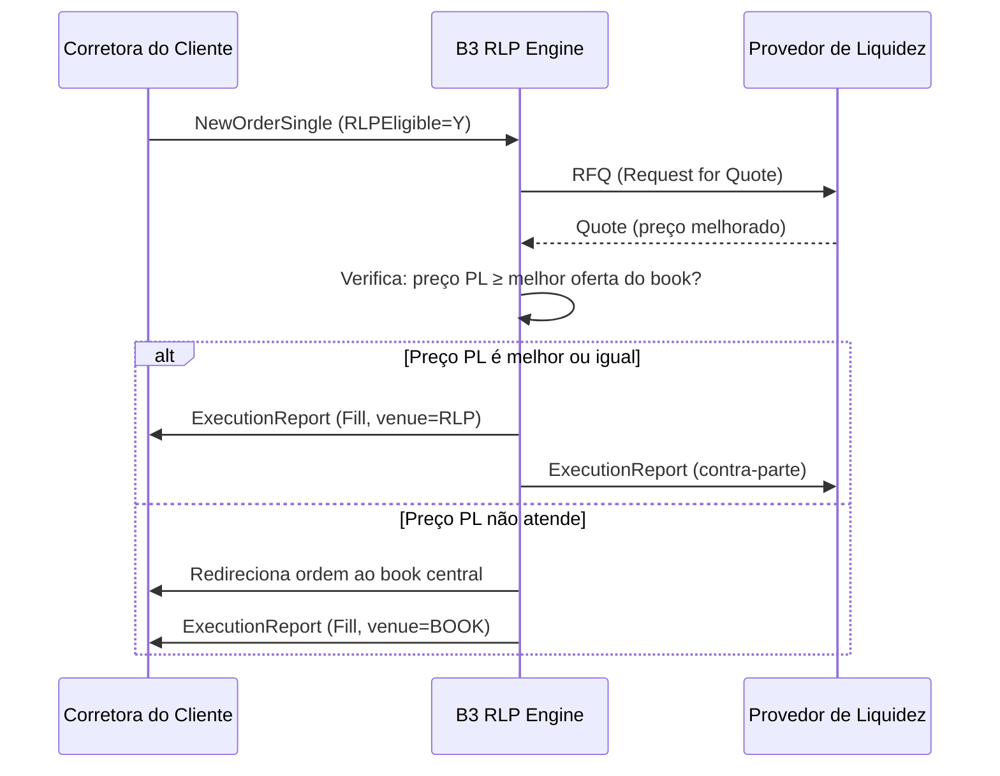

# RLP — Aspecto Técnico

## Visão geral da arquitetura

O RLP na B3 é implementado sobre o protocolo **FIX 4.4** com extensões proprietárias, integrado ao sistema **PUMA Trade System** (plataforma de negociação da B3). O fluxo de mensagens envolve a corretora do cliente, o motor de internalização da B3 e a mesa do Provedor de Liquidez (PL).

```
[Corretora do Cliente]         [B3 — PUMA / RLP Engine]       [Provedor de Liquidez]
         |                               |                              |
         |—— NewOrderSingle (RLP=Y) ———>|                              |
         |                               |—— RFQ (Request for Quote) —>|
         |                               |                              |
         |                               |<—— Quote (preço melhorado) ——|
         |                               |                              |
         |<—— ExecutionReport (Fill) ————|                              |
         |        ou                     |                              |
         |<—— Redirecionamento ao book ——|                              |
```

## Protocolo FIX — Mensagens principais

### 1. `NewOrderSingle` (MsgType = D) — Corretora → B3

A ordem de varejo elegível para RLP deve incluir o campo customizado que indica a elegibilidade ao programa:

| Tag FIX | Nome | Valor para RLP |
|---|---|---|
| `35` | MsgType | `D` |
| `54` | Side | `1` (Buy) / `2` (Sell) |
| `38` | OrderQty | Quantidade desejada |
| `44` | Price | Preço limite (ou vazio para Market) |
| `40` | OrdType | `2` (Limit) / `1` (Market) |
| `9303` *(custom B3)* | RLPEligible | `Y` — indica ordem elegível ao RLP |
| `9304` *(custom B3)* | InvestorType | `1` — Pessoa Física |

> **Nota**: as tags customizadas (prefixo `9xxx`) são definidas no documento *FIX Interface Specification — PUMA* disponível no portal de desenvolvedores da B3.

### 2. `Quote` (MsgType = S) — PL → B3

O PL responde à requisição com sua cotação:

| Tag FIX | Nome | Descrição |
|---|---|---|
| `35` | MsgType | `S` |
| `117` | QuoteID | Identificador único da cotação |
| `132` | BidPx | Preço de compra ofertado pelo PL |
| `133` | OfferPx | Preço de venda ofertado pelo PL |
| `134` | BidSize | Quantidade disponível no bid |
| `135` | OfferSize | Quantidade disponível no offer |
| `62` | ValidUntilTime | Validade da cotação (em microssegundos) |

### 3. `ExecutionReport` (MsgType = 8) — B3 → Corretora

Confirmação de execução (total ou parcial):

| Tag FIX | Nome | Valores relevantes |
|---|---|---|
| `35` | MsgType | `8` |
| `150` | ExecType | `F` (Trade / Fill) |
| `39` | OrdStatus | `2` (Filled) / `1` (Partial) |
| `31` | LastPx | Preço de execução |
| `32` | LastQty | Quantidade executada |
| `9305` *(custom B3)* | ExecutionVenue | `RLP` — confirma execução via internalização |

## Fluxo de tempo real



## Conectividade e ambientes

| Ambiente | Host (referência) | Finalidade |
|---|---|---|
| **Produção** | `fixgw.b3.com.br` | Negociação real |
| **Homologação (CERT)** | `fixgw-cert.b3.com.br` | Testes de certificação |
| **Simulação (SIM)** | `fixgw-sim.b3.com.br` | Testes de desenvolvimento |

> Os nomes de host são meramente ilustrativos. As **portas e credenciais de acesso** (username, senha, SenderCompID, TargetCompID) são **confidenciais** e fornecidas exclusivamente durante o processo de credenciamento técnico. Acesse o **Portal de Participantes B3** para iniciar o processo de habilitação.

## Requisitos técnicos para o Provedor de Liquidez

### Latência
- O PL deve responder ao RFQ em **menos de 1 ms** (configurável pela B3 até limite máximo);
- Recomenda-se colocação no **data center da B3 (Cotia/SP)** para minimizar latência de rede.

### Infraestrutura recomendada

| Componente | Especificação mínima |
|---|---|
| Servidor de cotação | CPU de baixa latência, kernel RT Linux ou Windows Server com tuning de rede |
| Conectividade | Cross-connect no data center B3 (fibra dedicada, sem internet pública) |
| Sessão FIX | Sessão FIX persistente com heartbeat configurado para `≤ 30s` |
| Redundância | Sessão primária + sessão failover em rack separado |

### Sistema de gestão de risco pré-negociação

Antes de enviar o `Quote`, o sistema do PL deve verificar:

1. **Exposição líquida**: a posição resultante da internalização não ultrapassa os limites de risco;
2. **Disponibilidade de capital**: verificação de margem/capital disponível para a operação;
3. **Limites por ativo**: limites de concentração por papel definidos internamente;
4. **Circuit breaker**: desativação automática do PL em caso de anomalia de mercado.

## Certificação e credenciamento técnico

O processo de credenciamento técnico na B3 envolve as seguintes etapas:

1. **Solicitação de acesso**: contato com a área comercial da B3 para habilitação ao programa;
2. **Documentação técnica**: assinatura do NDA e acesso ao manual FIX do RLP;
3. **Desenvolvimento**: implementação das mensagens FIX customizadas;
4. **Testes no ambiente CERT**: validação dos fluxos com o time de certificação da B3;
5. **Testes de carga**: simulação de volume de ordens em ambiente SIM;
6. **Go-live**: habilitação em produção mediante aprovação da B3.

## Monitoramento operacional

| Métrica | Ferramenta / Fonte |
|---|---|
| Taxa de Fill via RLP | Relatório diário da B3 (arquivo DAIR / RLP report) |
| Latência de resposta | Logs da sessão FIX (`SendingTime` vs `TransactTime`) |
| Taxa de rejeição de cotações | Contagem de `ExecutionReport` com `OrdStatus=8` (Rejected) |
| Disponibilidade do PL | Monitoramento de heartbeat da sessão FIX |
