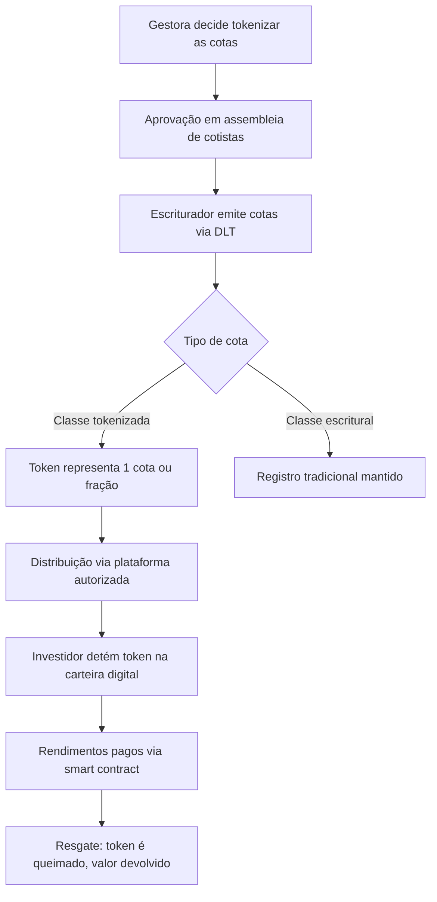

# Fundos de Investimento Tokenizados

A **tokenização de cotas de fundos de investimento** consiste em representar cada cota — ou fração dela — como um token em uma infraestrutura de registro distribuído (DLT). A **Resolução CVM nº 175/2022** foi o marco legal que explicitamente habilitou a emissão de cotas em formato tokenizado no Brasil, equiparando-as juridicamente às cotas escriturais tradicionais.

## Base regulatória: Resolução CVM nº 175/2022

A CVM 175 trouxe duas inovações fundamentais para a tokenização de fundos:

1. **Cotas tokenizadas equiparadas a cotas escriturais**: o artigo 47 da resolução permite que fundos emitam cotas em DLT, desde que o escriturador seja entidade autorizada pela CVM. Os detentores de tokens têm os mesmos direitos que cotistas tradicionais.
2. **Estrutura de classes**: a nova norma permite que um único fundo tenha **múltiplas classes de cotas** com características diferentes — inclusive classes tokenizadas e classes escriturais coexistindo no mesmo veículo.

## Classes de fundos elegíveis à tokenização

| Classe | Tipo de cota tokenizável | Observação |
|--------|--------------------------|------------|
| **FIF** (Renda Fixa, Cambial, Multimercado) | Sim | Mais comum no mercado atual |
| **FIA** (Fundo de Ações) | Sim | Liquidez alinhada ao mercado de ações |
| **FIP** (Fundo de Participações) | Sim | Tokens representam participação em empresas |
| **FIC** (Fundo de Cotas) | Sim | Token do FIC representa cotas de outro fundo |
| **FIDC** (Fundo de Direitos Creditórios) | Sim | Tokenização de recebíveis |
| **FII** (Fundo Imobiliário) | Sim | Cotas negociadas on-chain |

## Fluxo de tokenização de cotas

## Requisitos para tokenização de cotas (CVM 175)

Para que cotas tokenizadas sejam válidas sob a CVM 175, o fundo deve atender:

1. **Escriturador autorizado**: entidade credenciada pela CVM para escrituração em DLT
2. **Regulamento atualizado**: o regulamento do fundo deve prever explicitamente a emissão de cotas tokenizadas
3. **Aprovação em assembleia**: alterações ao regulamento requerem aprovação dos cotistas (conforme quórum previsto)
4. **Segregação patrimonial**: os ativos do fundo continuam segregados do patrimônio do administrador
5. **Relatórios e transparência**: obrigações de divulgação à CVM se mantêm inalteradas

## Come-cotas em fundos tokenizados

O mecanismo de **come-cotas** (antecipação semestral de IR em maio e novembro) aplica-se igualmente a fundos tokenizados. Na data do come-cotas, o smart contract pode:
- **Queimar** automaticamente a fração de tokens correspondente ao IR devido
- Ou **reduzir** o valor unitário do token

Fundos isentos do come-cotas (FIA, FIP enquadrado como venture capital) permanecem isentos independentemente de serem tokenizados.

## Tributação de cotas tokenizadas

A tokenização **não altera a tributação** das cotas de fundos:

| Tipo de fundo | Tabela | Come-cotas |
|--------------|--------|-----------|
| FIF Longo Prazo | Regressiva (15% a 22,5%) | Sim (maio/novembro) |
| FIF Curto Prazo | 20% flat | Sim (maio/novembro) |
| FIA | Regressiva (15% a 22,5%) | Não |
| FIP (qualificado) | 15% no resgate | Não |
| FII (bolsa) | 20% sobre ganho de capital | Não |

## Vantagens da tokenização para fundos

### Para o investidor
- **Fracionamento maior**: possibilidade de aplicar com valores menores
- **Liquidez secundária**: transferência peer-to-peer de cotas (dentro de regras KYC)
- **Transparência**: posição e rendimentos consultáveis on-chain a qualquer momento
- **Composabilidade**: cotas tokenizadas podem ser usadas como colateral em protocolos DeFi regulados

### Para a gestora / administradora
- **Eficiência operacional**: automação de distribuição de rendimentos, come-cotas e resgates
- **Acesso a novos investidores**: plataformas digitais ampliam o público
- **Redução de custos**: menor intermediação no processo de distribuição

## Ecossistema de fundos tokenizados no Brasil

| Participante | Papel | Exemplos |
|-------------|-------|---------|
| **Gestora** | Decide estratégia e solicita tokenização | BTG Pactual, XP, Kinea |
| **Administrador** | Controle operacional, compliance CVM | BTG, BRL Trust, Oliveira Trust |
| **Escriturador DLT** | Emite tokens na blockchain | B3 Digital, Vórtx |
| **Custodiante** | Guarda dos ativos subjacentes | Itaú, Bradesco, BNY Mellon |
| **Distribuidor** | Canal de venda ao investidor final | Fintechs, bancos digitais, plataformas DeFi |
| **Auditores** | Validação de smart contracts | Big Four + firmas especializadas em segurança DLT |

## Riscos específicos

- **Risco de smart contract**: bugs no código podem travar resgates ou distribuir rendimentos incorretamente
- **Risco de governança**: decisões de assembleia que alteram o regulamento precisam refletir na lógica do smart contract
- **Risco de fragmentação**: coexistência de classes tokenizadas e escriturais pode gerar conflitos de liquidez
- **Risco regulatório**: interpretações futuras da CVM sobre DLT podem impor requisitos adicionais

## Sandbox regulatório (CVM 88/2022 e 96/2022)

Gestoras que desejam testar estruturas inovadoras de fundos tokenizados podem pleitear ingresso no **Ambiente Regulatório Experimental (ARE)** da CVM, obtendo:
- Dispensa temporária de algumas exigências da CVM 175
- Período experimental de até 24 meses
- Relatórios mensais de acompanhamento à CVM
- Possibilidade de conversão em autorização definitiva ao fim do projeto
