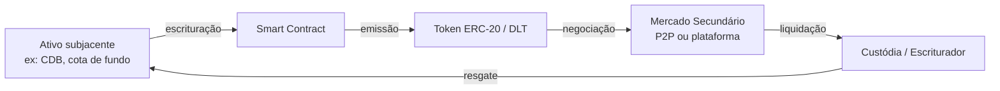

# Tokenização de Ativos Financeiros

**Tokenização** é o processo de representar direitos sobre um ativo real ou financeiro em um **token digital** registrado em uma infraestrutura de registro distribuído (DLT — _Distributed Ledger Technology_), como uma blockchain. No mercado financeiro brasileiro, a tokenização permite emitir, negociar e liquidar ativos como CDBs, LCIs, cotas de fundos e debêntures de forma nativa em ambientes digitais programáveis.

## Como funciona a tokenização

1. **Originação**: o emissor (banco, gestora, SPE) define os parâmetros do ativo — taxa, prazo, garantias.
2. **Escrituração digital**: um _smart contract_ registra os termos do ativo em uma DLT permissionada ou pública.
3. **Emissão do token**: cada token representa uma fração ou a totalidade dos direitos sobre o ativo.
4. **Negociação**: os tokens podem ser transferidos entre carteiras, negociados em plataformas ou mantidos até o vencimento.
5. **Liquidação e resgate**: na data de vencimento (ou resgate antecipado), o smart contract distribui os rendimentos aos detentores.

## Infraestruturas de DLT no Brasil

| Plataforma | Operador | Tecnologia | Uso |
|-----------|----------|-----------|-----|
| **B3 Digital** | B3 | Hyperledger Besu | CDB, LCI, CRA, cotas de fundo |
| **Liqi** | Liqi Digital Assets | Ethereum/Polygon | Recebíveis, CCBs |
| **Drex** | BCB | Hyperledger Besu | CBDC e liquidação wholesale |
| **BTG Pactual** | BTG Digital | Plataforma própria | Fundos tokenizados |
| **Hashdex/B3** | Vários | Ethereum | ETFs de cripto, tokens de valor mobiliário |

## Marco regulatório brasileiro

### Lei nº 14.478/2022 — Marco Legal dos Criptoativos

Sancionada em dezembro de 2022, a lei estabelece o **arcabouço legal para prestadores de serviços de ativos virtuais (VASPs)** no Brasil. Define:
- Ativo virtual como representação digital de valor que pode ser negociado ou transferido eletronicamente
- Obrigação de autorização prévia do Banco Central para operar como VASP
- Regras de combate à lavagem de dinheiro e proteção ao consumidor

### Resolução CVM nº 88/2022 — Ambiente Regulatório Experimental (ARE)

Criou o **sandbox regulatório** da CVM para empresas que desejam testar modelos de negócio inovadores envolvendo valores mobiliários tokenizados. Participantes do ARE recebem dispensa temporária de certas exigências regulatórias, mediante aprovação de projeto pela CVM.

### Resolução CVM nº 96/2022 — Tokens de Valores Mobiliários

Ampliou o ARE e disciplinou a emissão de **tokens que representam valores mobiliários**, incluindo:
- Critérios para classificar um token como valor mobiliário
- Obrigações de registro, custódia e escrituração
- Requisitos de KYC/AML para emissores e distribuidores

### Resolução CVM nº 175/2022 — Tokenização de Cotas de Fundos

Permitiu que fundos de investimento emitam suas **cotas em formato tokenizado** (DLT), desde que o escriturador seja entidade autorizada pela CVM. A regulação equipara cotas tokenizadas às cotas escriturais tradicionais para fins legais e tributários.

## Diferenças em relação ao mercado tradicional

| Aspecto | Mercado tradicional | Mercado tokenizado |
|---------|--------------------|--------------------|
| Liquidação | D+1 ou D+2 | Instantânea (DVP atômico) |
| Fracionamento | Valor mínimo definido | Qualquer fração |
| Custódia | SELIC, B3, CETIP | Smart contract / custódia digital |
| Transferência | Via corretora/distribuidora | Peer-to-peer (com regras regulatórias) |
| Auditoria | Relatórios periódicos | Transparência on-chain em tempo real |
| Automação | Manual / semi-automático | Pagamentos automáticos via smart contract |

## Riscos específicos da tokenização

- **Risco tecnológico**: falhas em smart contracts ou no protocolo DLT
- **Risco de custódia de chaves privadas**: perda de acesso à carteira pode implicar perda dos tokens
- **Risco regulatório**: arcabouço ainda em evolução; novas normas podem alterar as regras do jogo
- **Risco de liquidez**: mercado secundário ainda incipiente para a maioria dos ativos tokenizados
- **Risco operacional**: integração entre sistemas legados e infraestrutura DLT

## Por onde começar

- [Renda Fixa Tokenizada](renda-fixa) — CDB, LCI, LCA, CRI, CRA e debêntures em formato digital
- [Fundos Tokenizados](fundos) — Cotas de FIF, FIA, FIP e FIC emitidas em DLT
