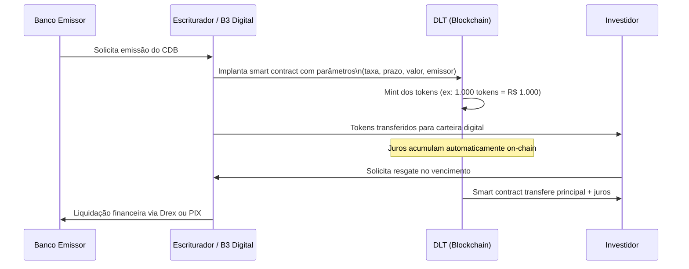

# Renda Fixa Tokenizada

A tokenização de **instrumentos de renda fixa** consiste em representar títulos de dívida — como CDBs, LCIs, LCAs, CRIs, CRAs e debêntures — como tokens em uma infraestrutura de registro distribuído (DLT). O detentor do token adquire os mesmos direitos econômicos e jurídicos do ativo subjacente, agora com a possibilidade de negociação fracionada, liquidação instantânea e automação de pagamentos via smart contract.

## Ativos elegíveis à tokenização

| Instrumento | Emissor típico | Garantia / FGC | Regulação principal |
|------------|---------------|----------------|---------------------|
| **CDB Tokenizado** | Bancos | FGC até R$ 250k | Res. CMN 4.966/2021 |
| **LCI Tokenizada** | Bancos | FGC até R$ 250k | Res. CMN 4.966/2021 |
| **LCA Tokenizada** | Bancos / cooperativas | FGC até R$ 250k | Res. CMN 4.966/2021 |
| **CRI Tokenizado** | Securitizadoras | Sem FGC | Res. CVM 60/2022 |
| **CRA Tokenizado** | Securitizadoras | Sem FGC | Res. CVM 60/2022 |
| **Debênture Tokenizada** | S.A. não financeiras | Sem FGC | Res. CVM 160/2022 |
| **Letra Financeira Tokenizada** | Bancos | Sem FGC | Res. CMN 4.966/2021 |

## Fluxo de emissão de um CDB tokenizado

## Regulação aplicável

### Resolução CMN nº 4.966/2021

Disciplina o reconhecimento e mensuração de instrumentos financeiros (alinhamento ao IFRS 9). Títulos tokenizados continuam sujeitos às mesmas regras contábeis e prudenciais dos instrumentos escriturais tradicionais — a tokenização altera apenas o **meio de registro e transferência**, não a natureza jurídica do ativo.

### Resolução CVM nº 88/2022 — Sandbox (ARE)

Emissores e distribuidores de instrumentos de renda fixa tokenizados que constituam valores mobiliários podem pleitear ingresso no **Ambiente Regulatório Experimental (ARE)** da CVM. Dentro do sandbox:
- Dispensa temporária de certas exigências de registro
- Limite de captação por projeto
- Relatórios trimestrais à CVM
- Prazo máximo de 2 anos para o projeto experimental

### Resolução CVM nº 96/2022 — Tokens de Valores Mobiliários

Define que um token é considerado **valor mobiliário** quando confere ao detentor:
- Direito a participação em lucros, receitas ou resultado
- Expectativa de retorno decorrente do esforço de terceiros

CRIs, CRAs e debêntures tokenizados se enquadram como valores mobiliários; CDBs, LCIs e LCAs bancários ficam sob supervisão do **BCB** (não da CVM).

### Lei nº 14.478/2022 — Marco Legal dos Criptoativos

Mesmo para ativos de renda fixa que não sejam valores mobiliários (ex: CDB tokenizado), as plataformas de negociação e custódia de tokens devem ser autorizadas como **VASP** pelo BCB, com obrigações de:
- KYC/AML rigoroso
- Segregação patrimonial
- Relatórios ao COAF

## Tributação de renda fixa tokenizada

A tokenização **não altera a tributação**. Aplicam-se as mesmas alíquotas de IR regressivo:

| Prazo de aplicação | Alíquota IR |
|-------------------|-------------|
| Até 180 dias | 22,5% |
| 181 a 360 dias | 20,0% |
| 361 a 720 dias | 17,5% |
| Acima de 720 dias | 15,0% |

IOF incide sobre resgates em menos de 30 dias.

> **Isenção de IR**: LCI e LCA tokenizadas mantêm a isenção de Imposto de Renda para pessoas físicas, conforme a legislação tributária vigente.

## Custódia e escrituração

Para que um token de renda fixa seja válido juridicamente no Brasil, ele precisa:

1. **Ser escriturado** por entidade autorizada pelo BCB (para instrumentos bancários) ou pela CVM (para valores mobiliários)
2. **Contar com segregação patrimonial**: os ativos subjacentes ficam em custódia separada do patrimônio do emissor
3. **Ter registro em DLT reconhecida** pelo escriturador ou pela infraestrutura do mercado (ex: B3 Digital, CETIP Digital)

## B3 Digital — Plataforma de tokenização

A **B3 Digital** é a infraestrutura de tokenização da B3, operando sobre a rede Hyperledger Besu (permissionada). Funcionalidades:

- Emissão nativa de CDBs, LCIs, LCAs e CRIs tokenizados
- Liquidação DVP (entrega contra pagamento) atômica via Drex
- Integração com os sistemas de custódia da B3
- APIs para distribuidoras, fintechs e bancos digitais

## Comparativo: renda fixa tradicional vs. tokenizada

| Característica | Tradicional | Tokenizada |
|---------------|------------|-----------|
| Registro | SELIC (títulos públicos) / B3/CETIP | DLT (blockchain) |
| Fracionamento mínimo | R$ 1.000 (típico) | R$ 1,00 (ou menor) |
| Liquidez secundária | Limitada | P2P via smart contract |
| Pagamento de juros | Manual / D+1 | Automático (smart contract) |
| Transferibilidade | Via distribuidora | Carteira para carteira (KYC) |
| Acesso | Plataformas de corretagem | Apps DeFi + plataformas reguladas |
